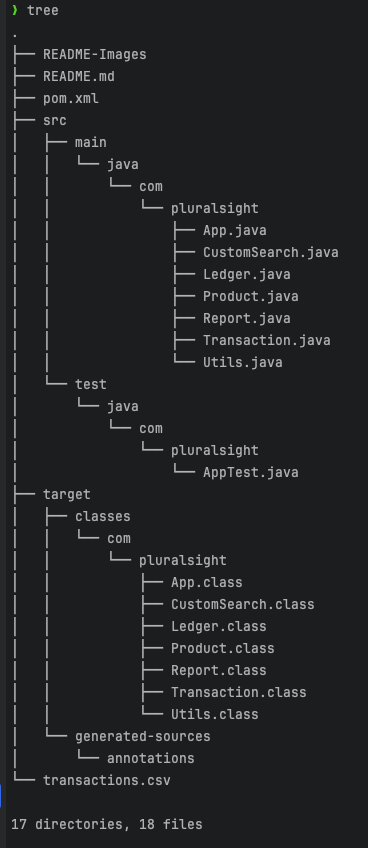

# Accounting Ledger

This is **Java-based CLI application** for tracking financial transactions. The app allows you to easily track deposits, make payments and generate reports for your transactions. The ledger provides a simple and effective way to manage personal finances from the command line.

---

## Requirements

- [Git](https://git-scm.com/downloads)
- [Java 17](https://www.oracle.com/th/java/technologies/downloads/) or Higher
- [IntelliJ IDEA](https://www.jetbrains.com/idea/download/)
- A properly formatted [`transactions.csv`](#file-transactionscsv-format) file in the project directory
---

## Usage

1. Clone the repo:
```bash
git clone https://github.com/joe-bor/AccountingLedger.git
cd AccountingLedger
```

2. Launch Project in IntelliJ IDEA:
   - Click `Open` and select project directory.
   - Go to `Build` > `Build Project`

3. Run the Application:
   - Open `App.java` file insidei `src/com/pluralsight` directory.
   - Right-click on the `App` class and select `Run 'App.main()'`
   
4. Interact with the CLI:
   - Follow the instructions displayed in the terminal.

---

## How It Works

- **Add Deposit (D)**: Record an incoming transaction with an amount, description, and vendor.
- **Make Payment (P)**: Log a payment transaction.
- **View Ledger (L)**: Shows options for displaying transactions (sorted by date in descending order, unless specified)
- **Reports (R)**: Generate predefined or custom reports on transactions.
- **Exit (X)**: Terminate the program.

---

## Features

1. **Deposit and Payment Tracking**
   - Log Deposits and payments to maintain up-to-date-ledger.
2. **Ledger Management**
   - View transaction, filtered by deposits, payments, or all entries.
3. **Reports Generation**
   - Generate reports for:
     - Month-to-Date transactions
     - Previous Month transactions
     - Year-to-Date transactions
     - Previous Year transactions
     - Search by Vendor or [Custom Search](#Custom-Search-Capabilities)
4. **CSV Integration**
   - All transactions are stored and retrieved from `transactions.csv` for persistence.

---

## Limitations

- The project does not currently have unit tests.
- The app assumes [`transactions.csv`](#file-transactionscsv-format) file is correctly formatted, with no validations.

---

## Screenshots

**Project Structure** 




---

## File `transactions.csv` Format
Each entry to this file must follow the following structure:

```text
date|time|description|vendor|amount
2024-10-01|12:00|Netflix Subscription|Netflix|15.99
2024-09-01|10:30|House Rent|Landlord|4500.00
```

- **date**: The transaction date in `YYYY-MM-DD` format.
- **time**: The transaction time in `HH:mm` (24-hour) format.
- **description**: A brief description of the transaction.
- **vendor**: The name of the vendor/payee.
- **amount**: The transaction amount as a floating-point value.

---

## Custom Search Capabilities
The `Custom Search` feature in the `Reports` sections allows for filtering of transaction using the following criteria:
- **Start Date**: Find transactions after a specific date.
- **End Date**: Find transactions before a specific date.
- **Description**: Search for transactions by keywords in the description.
- **Vendor**: Filter transactions by vendor name.
- **Amount**: Find transactions with a specific amount.