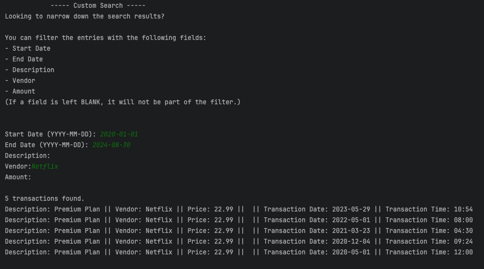

[](https://git.io/typing-svg)

This is **Java-based CLI application** for tracking financial transactions. The app allows you to easily track deposits,
make payments and generate reports for your transactions. The ledger provides a simple and effective way to manage
personal finances from the command line.

[Link to GitHub Project](https://github.com/users/joe-bor/projects/5/views/1)

---

## Table of Contents

- [Requirements](#requirements)
- [Usage](#usage)
- [How it Works](#how-it-works)
- [Features](#features)
- [Limitations](#limitations)
- [Screenshots](#screenshots)
- [File `transactions.csv` Format](#file-transactionscsv-format)
- [Custom Search Capabilities](#custom-search-capabilities)

---

## Requirements

- [Git](https://git-scm.com/downloads)
- [Java 17](https://www.oracle.com/th/java/technologies/downloads/) or Higher
- [IntelliJ IDEA](https://www.jetbrains.com/idea/download/)
- A properly formatted [`transactions.csv`](#file-transactionscsv-format) file in the project directory

<div>
   
   
   
</div>

---

## Usage

1. Clone the repo:

```bash
git clone https://github.com/joe-bor/AccountingLedger.git
cd AccountingLedger
```

2. Launch Project in IntelliJ IDEA:
    - Click `Open` and select project directory.
    - Go to `Build` > `Build Project`

3. Run the Application:
    - Open `App.java` file inside `src/com/pluralsight` directory.
    - Right-click on the `App` class and select `Run 'App.main()'`

4. Interact with the CLI:
    - Follow the instructions displayed in the terminal.

---

## How It Works

- **Add Deposit (D)**: Record an incoming transaction with an amount, description, and vendor.
- **Make Payment (P)**: Log a payment transaction.
- **View Ledger (L)**: Shows options for displaying transactions (sorted by date in descending order, unless specified)
- **Reports (R)**: Generate predefined or custom reports on transactions.
- **Exit (X)**: Terminate the program.

---

## Features

1. **Deposit and Payment Tracking**
    - Log Deposits and payments to maintain up-to-date-ledger.
2. **Ledger Management**
    - View transaction, filtered by deposits, payments, or all entries.
3. **Reports Generation**
    - Generate reports for:
        - Month-to-Date transactions
        - Previous Month transactions
        - Year-to-Date transactions
        - Previous Year transactions
        - Search by Vendor or [Custom Search](#Custom-Search-Capabilities)
4. **CSV Integration**
    - All transactions are stored and retrieved from `transactions.csv` for persistence.

---

## Limitations

- The project does not currently have unit tests.
- The app assumes [`transactions.csv`](#file-transactionscsv-format) file is correctly formatted, with no validations.

---

## Screenshots

<!-- Project Structure -->
[](https://git.io/typing-svg)


<!-- Home Screen -->
[](https://git.io/typing-svg)


<!-- Ledger Screen -->
[](https://git.io/typing-svg)


<!-- Reports Screen -->
[](https://git.io/typing-svg)


<!-- Custom Search -->
[](https://git.io/typing-svg)




<!-- Year Overview -->
[](https://git.io/typing-svg)


<!-- Month Overview -->
[](https://git.io/typing-svg)


---

## File `transactions.csv` Format

Each entry to this file must follow the following structure:

```text
date|time|description|vendor|amount
2024-10-01|12:00|Netflix Subscription|Netflix|15.99
2024-09-01|10:30|House Rent|Landlord|4500.00
```

- **date**: The transaction date in `YYYY-MM-DD` format.
- **time**: The transaction time in `HH:mm` (24-hour) format.
- **description**: A brief description of the transaction.
- **vendor**: The name of the vendor/payee.
- **amount**: The transaction amount as a floating-point value.

---

## Custom Search Capabilities

The `Custom Search` feature in the `Reports` sections allows for filtering of transaction using the following criteria:

- **Start Date**: Find transactions after a specific date.
- **End Date**: Find transactions before a specific date.
- **Description**: Search for transactions by keywords in the description.
- **Vendor**: Filter transactions by vendor name.
- **Amount**: Find transactions with a specific amount.

---

[](https://git.io/typing-svg)

```java
public void yearlyOverview() {
   int currYear = LocalDate.now().getYear();

   System.out.printf("""
                       --- %d Overview ---
           Curious about how your finances are looking this year?
           Look at the breakdown below:
           
           """, currYear);

   float totalDeposits = this.getTransactionList().stream()
           .filter(transaction -> transaction.getTransactionDate().getYear() == currYear)
           .filter(transaction -> transaction.getProduct().price() > 0)
           .map(transaction -> transaction.getProduct().price())
           .reduce(0f, (acc, curr) -> acc + curr);

   float totalPayments = this.getTransactionList().stream()
           .filter(transaction -> transaction.getTransactionDate().getYear() == currYear)
           .filter(transaction -> transaction.getProduct().price() < 0)
           .map(transaction -> transaction.getProduct().price())
           .reduce(0f, (acc, curr) -> acc + curr);

   float netIncome = totalPayments + totalDeposits;

   System.out.printf("Total Income: %.2f\n", totalDeposits);
   System.out.printf("Total Expenses: %.2f\n", totalPayments);
   System.out.printf("Net Income for the year: %.2f\n", netIncome);
}
```

With the extra time I decided to dive deeper into [Java's Streams API](https://www.oracle.com/technical-resources/articles/java/ma14-java-se-8-streams.html) and apply it to the current codebase.

Every method chained in the pipeline would have been another for loop if I had not use `Streams`. This could have been used in the `Custom Search` feature also for more brevity.

Some of the few things I briefly learned about are:
   - Collections API
   - Streams API
   - Lambda Expressions
   - Predicate Functions